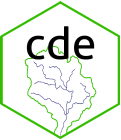

<!-- README.md is generated from README.Rmd. Please edit that file -->

```{r, echo = FALSE}
knitr::opts_chunk$set(
  collapse = TRUE,
  comment = "#>",
  fig.path = "README-"
)
```

# cde 
[](https://travis-ci.org/robbriers/cde) [](https://coveralls.io/github/robbriers/cde?branch=master) [](https://www.repostatus.org/#active) [](https://zenodo.org/badge/latestdoi/92712854) [](https://github.com/ropensci/onboarding/issues/284)

## Introduction

Within Europe, the [Water Framework Directive](http://ec.europa.eu/environment/water/water-framework/index_en.html) (WFD) sets EU-wide standards for how the quality of surface- and ground-waters across Europe is assessed and classified. Assessment of quality using the WFD is based on a range of elements that vary depending on the type of water being assessed and are combined to give an overall classification of waterbodies into five classes (High, Good, Moderate, Poor and Bad) for surface waters and two classes (Good or Poor) for groundwaters.

In the UK the Environment Agency (EA) is the competent authority responsible for monitoring and assessment of water quality within England. The EA have made the reporting data relating to the requirements of the WFD available via the Catchment Data Explorer (CDE) website, [https://environment.data.gov.uk/catchment-planning/](https://environment.data.gov.uk/catchment-planning/). 

`cde` is a package for R which facilitates searching and download of the WFD reporting data for all waterbodies from the EA CDE website.

The types of data that can be downloaded are: WFD status classification data (which can also be plotted), Reasons for Not Achieving Good (RNAG) status, objectives set for waterbodies, measures put in place to improve water quality and details of associated protected areas.

The CDE data are made available under the [Open Government Licence v3.0](https://www.nationalarchives.gov.uk/doc/open-government-licence/version/3/) and use of the data accessed by and contained within this package implies acceptance of these licence conditions.

## Installation

You can install cde from github with:

```{r gh-installation, eval = FALSE}
# install.packages("remotes")
remotes::install_github("robbriers/cde")
```

## Basic usage

See the 'Get started' vignette or 'Reference' sections above for details of the different functions.
